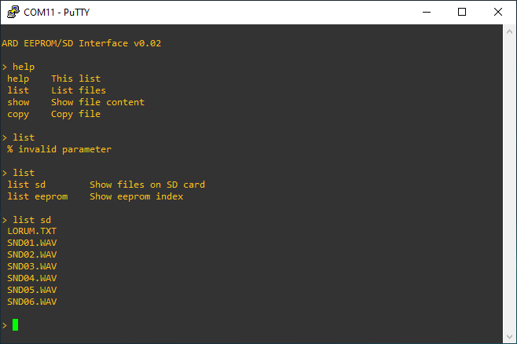

# arduino-cli
A simple and easy to use console command line interface for the Arduino serial connection, loosly inspired by Cisco IOS CLI.
The begin() function will call your own Exec after pressing \<enter>, or Help function when pressing \<tab> or \<?>. These functions require a char[] paramater to be able to pass the active command. To exit the interface, call the exit() function from one of these functions.  

#### Usage:  
```
ardcli ardCli;  
void functionExec(char data[]) { 
  // Your code here
};  
void functionHelp(char data[]) { 
  // Your code here
};  
ardCli.begin(functionExec, functionHelp);  
```
The .ino file contains the class, and includes a simple but full demo.

#### Example output:



# About
This small class is written as a fast and easy solution for testing and interaction during the development of a simple tool to read, write and copy data from/to an EEPROM, and an SD card. This project will be added later.  
The author (me) is not a professional programmer. Any tips and/or improvements are very welcome.
